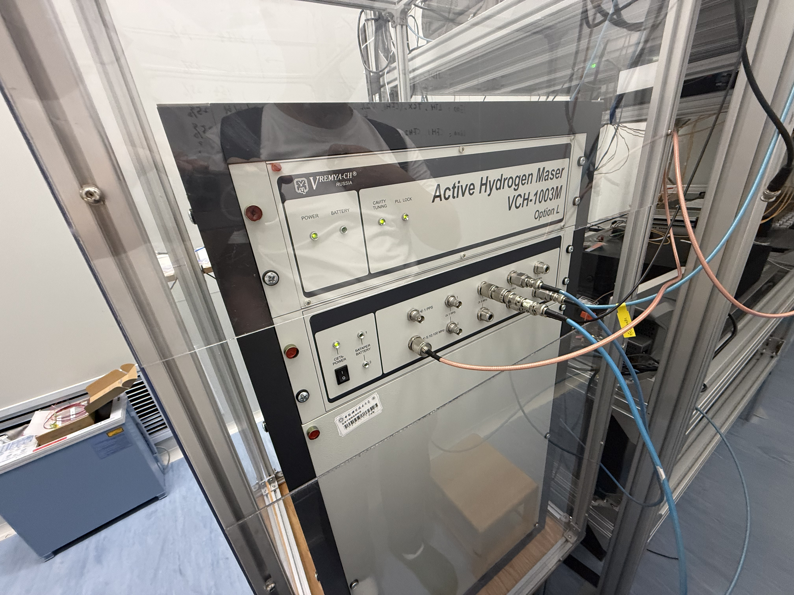

# 氢钟设备、调节与比对测试照片说明

本文档整理 `HM/photos/` 中的六张照片，目标是说明氢钟设备本体、厂商指标、频率调节接口，以及它与 GPS 驯服铷钟和上海锶原子光钟进行比对时得到的结果。

## 1. 阅读逻辑

六张照片的原始图号保留不变，但按以下逻辑阅读更清楚：

1. **先认识设备**：图 5（正面和接口）与图 3（整机机柜/屏蔽外观）。
2. **再看标称能力**：图 2（厂商给出的稳定度和环境敏感度指标）。
3. **然后理解可调参数**：图 4（频率漂移补偿/输出频率控制位置）。
4. **最后看实测表现**：图 1（GPS 驯服铷钟与氢钟拍频稳定度）和图 6（氢钟与上海锶原子光钟拍频结果）。

> 说明：文中“照片可见”表示可直接从画面读出的内容；“实验背景”来自用户提供的照片说明；“分析”是依据时间频率测量常识作出的解释。没有原始时间序列、仪器配置和信号链路记录时，不对照片中的结果作超出证据范围的定量结论。

## 2. 设备本体与安装

### 2.1 图 5：VCH-1003M 主动型氢钟正面



**照片可见：** 设备标识为俄罗斯 VREMYA-CH 生产的 `Active Hydrogen Maser VCH-1003M Option L`。正面状态区可以看到 `POWER`、`BATTERY`、`CAVITY TUNING` 和 `PLL LOCK` 等指示；下方为电源、`1 PPS` 以及多路频率输出接口，部分接口已经连接同轴电缆。

**相关说明：**

- 主动型氢钟利用氢原子超精细跃迁产生高稳定度微波参考，适合作为连续运行的本地频率基准或“飞轮钟”。
- `CAVITY TUNING` 和 `PLL LOCK` 指示与内部腔调谐、锁相状态有关。仅凭指示灯亮起可以判断相关环节处于工作状态，但完整健康判断仍应结合监控软件中的电压、温度、束流、泵和告警参数。
- 多路频率输出可分别送往频率计、光频梳、分配放大器或时间间隔测量设备。不同输出端口、线缆和分配链可能引入额外相位噪声或温度相关延迟，因此正式比对应记录具体端口和线缆配置。

### 2.2 图 3：氢钟整机机柜与隔离结构


**照片可见：** 氢钟安装在独立机柜中，外围还有由型材和透明/不透明面板组成的封闭结构；附近布置了监控计算机和信号线缆。

**分析：** 氢钟的长期频率容易受到环境温度、磁场、供电和机械扰动影响。外围结构通常有助于减小空气流动、快速温变和人员活动造成的扰动，但照片本身不能证明其具体温控或磁屏蔽性能。建议在长期比对时同步记录机柜内外温度、磁场、供电状态以及开门维护时间，用于排查频率变化与环境事件之间的相关性。

## 3. 厂商标称指标

### 3.1 图 2：VCH-1003M 主要参数


**照片可见：** 厂商资料将 VCH-1003M 描述为主动型氢原子频率标准。画面中能够读取的主要指标如下。

| 指标 | 厂商给出的数值 |
| --- | ---: |
| 频率稳定度，1 s | `<= 1.5 x 10^-13` |
| 频率稳定度，10 s | `<= 2.5 x 10^-14` |
| 频率稳定度，100 s | `<= 6 x 10^-15` |
| 频率稳定度，1000 s | `<= 2 x 10^-15` |
| 频率稳定度，3600 s | `<= 1.5 x 10^-15` |
| 频率稳定度，1 day | `<= 7 x 10^-16` |
| 长期频率稳定度 | `< 3.0 x 10^-16/day` |
| 合成频率分辨率 | `1 x 10^-16` |
| 频率控制范围 | `1 x 10^-10` |
| 谐波（5 MHz 输出） | `< -30 dB` |
| 非谐波（10 Hz-10 kHz） | `< -100 dB` |
| 温度敏感性 | `<= 2 x 10^-15/degC` |
| 磁场灵敏度 | `<= 1 x 10^-14/Gauss` |

**如何使用这些指标：** 厂商指标是验收和实验设计的参考上限，不等于实验现场必然达到的结果。实测曲线还包含参考钟噪声、频率计噪声、分配链噪声、温度变化和数据处理方法的影响。将图 1 或图 6 与厂商指标比较前，必须确认使用的是 Allan deviation、Hadamard deviation 还是其他统计量，并统一平均时间和归一化方式。

## 4. 频率漂移补偿与控制位置

### 4.1 图 4：输出频率控制界面


**照片可见：** VCH-1003M 的控制软件中存在 `Output Frequency` 区域，包含 `Code (10^-16)` 数值框。照片标注显示一次操作将代码从 `556000` 调整为 `456000`；右侧还有 `ACT system parameters` 界面，显示 `DAC16min`、`DAC16mid`、`DAC16max`、`Phase shift`、`Duty factor`、`Average`、`DAC20` 等参数。操作记录窗口中同时保存了 CFC 调整记录。

**相关说明：**

- 该位置可用于对氢钟合成输出频率施加细调，使输出更接近目标参考频率，或补偿已评估的长期频率漂移。
- `Code (10^-16)` 表明控制量按很细的分数频率步进表达，但代码值到实际输出频率变化的比例、符号和生效方式必须以设备手册及校准实验为准。
- 照片中调整前后的 `Fout-Fref` 显示发生变化，说明控制动作已被系统读取；但不能只凭单个界面截图判断调整是否准确、是否已经稳定，或是否产生瞬态。

**建议的调节流程：**

1. 在调整前保存足够长的原始拍频数据和所有控制参数。
2. 记录调整时间、旧代码、新代码、参考源和操作者。
3. 调整后留出设备响应和重新稳定时间，避免把瞬态当成长期频率变化。
4. 用独立参考重新估计频率偏差与漂移率，不以软件显示值代替外部验证。
5. 若需要连续时间尺度，频率步进应在数据处理中保留并显式校正。

## 5. 与 GPS 驯服铷钟的拍频稳定度

### 5.1 图 1：铷钟驯服到 GPS 后与氢钟比对


**实验背景：** 图中结果来自“铷钟驯服到 GPS 后，再与氢钟进行拍频”的稳定度分析。

**照片可见：** 软件窗口显示相对频差的二样本统计曲线。随平均时间增加，曲线从约 `10^-11` 量级下降，在数百秒至数千秒附近进入约 `10^-12` 量级的平台并有起伏；更长平均时间处的点数明显减少。右侧表格列出了 `Tau`、统计值和样本数 `N`。

**分析：**

- 这条曲线是“GPS 驯服铷钟 + 氢钟 + 比较仪器与分配链”的组合结果，不能直接等同于氢钟单机稳定度。
- 短平均时间通常更多反映铷钟、氢钟和测量链的短期相位/频率噪声；GPS 驯服环路主要用于改善较长时间尺度的频率准确度和漂移，但其时间常数也可能在中长时间尺度形成平台或隆起。
- 长平均时间端的样本数 `N` 很小，末端点的统计置信度低。判断氢钟长期性能时，应延长连续测量时间，并给出置信区间或误差棒。
- 应明确软件计算的是 Allan deviation、Hadamard deviation 还是方差。若存在明显线性漂移，Hadamard deviation 通常更适合描述随机稳定度，而 Allan deviation 需要先说明是否去除了漂移。

若拍频为 $f_b(t)$，参考载频为 $f_0$，常用的分数频率偏差写为

$$
y(t)=\frac{f_b(t)-\overline{f_b}}{f_0}.
$$

稳定度统计量应对 $y(t)$ 而不是直接对拍频的赫兹数计算，并在报告中写明 $f_0$、采样间隔、去漂移方法、异常值处理和统计量类型。

## 6. 与上海锶原子光钟的拍频结果

### 6.1 图 6：光频梳测得的拍频与稳定度


**实验背景：** 该照片记录了氢钟与上海锶原子光钟经光频梳连接后的拍频结果。

**照片可见：**

- 拍频中心频率约为 `21 903 295.1 Hz`。
- 画面记录光频梳参数 `f_ceo = 160 MHz`、`f_r = 200 MHz`，梳齿数为 `966997`。
- 文档中的计算给出测得频率相对基准频率的差约为 `2.581 kHz`。
- 画面还记录“氢钟稳定度 1 s：`1 x 10^-13`，1000 s：`5 x 10^-15`”。

光频梳连接光学频率与微波参考的基本关系为

$$
f_{\mathrm{opt}}=n f_r+f_{\mathrm{ceo}}\pm f_b,
$$

其中 $n$ 是梳齿编号，$f_r$ 是重复频率，$f_{\mathrm{ceo}}$ 是载波包络偏移频率，$f_b$ 是光学拍频。正负号取决于被测激光位于相邻梳齿的哪一侧，必须由实验配置确认。

以照片给出的约 `2.581 kHz` 频差和约 `193.4 THz` 光学载频估算，对应分数频率差约为

$$
\frac{2.581\times10^3}{1.934\times10^{14}}
\approx1.33\times10^{-11},
$$

与照片文字中的数量级一致。

**关于“漂移约 2 kHz”的表述：** 单张照片能够确认的是某次计算得到约 `2.581 kHz` 的**频率偏差或频差**。严格的“漂移”应表示频率偏差随时间的变化率，例如 `Hz/day` 或分数频率每天的变化量；只有比较不同时间的连续数据并排除光梳锁定、梳齿编号和参考频率设置变化后，才能把该数值解释为漂移。

## 7. 六张照片形成的完整逻辑

```text
VCH-1003M 氢钟本体与接口（图 5）
        ↓
安装与环境隔离（图 3）
        ↓
厂商标称稳定度和环境敏感性（图 2）
        ↓
输出频率细调与漂移补偿（图 4）
        ↓
GPS 驯服铷钟对比：观察组合稳定度（图 1）
        ↓
锶原子光钟/光频梳对比：评估频率偏差和稳定度（图 6）
```

这套照片说明氢钟在实验系统中承担两种互补角色：一是连续输出、短中期稳定的本地微波参考；二是连接 GPS 驯服频标、光频梳和光学原子钟的“飞轮”。设备调节应由独立拍频结果验证，而拍频结果又必须结合参考源、光梳参数、统计方法和环境记录解释。

## 8. 建议补充的实验记录

为了把照片说明进一步升级为可复现的测试报告，建议补充：

- VCH-1003M 使用的具体输出端口和标称频率；
- GPS 驯服铷钟型号、驯服时间常数及是否进入稳态；
- 频率计/相位比较器型号、门时间和采样间隔；
- 图 1 使用的稳定度统计量、去漂移和异常值处理方法；
- 图 4 控制代码与实际分数频率变化的标定关系；
- 图 6 的光梳拍频符号、梳齿编号确认方法和锶钟参考频率；
- 全部测试的起止时间、有效样本数、温度、磁场、供电和设备维护日志。
