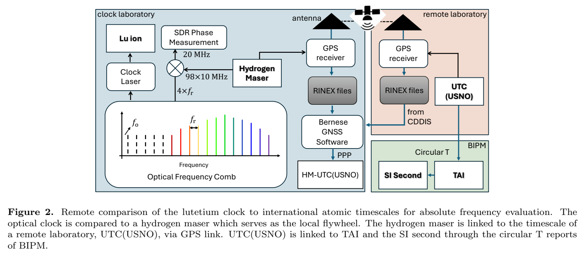
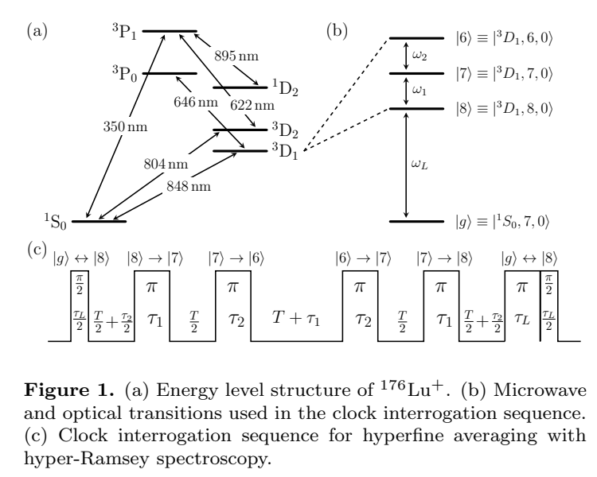
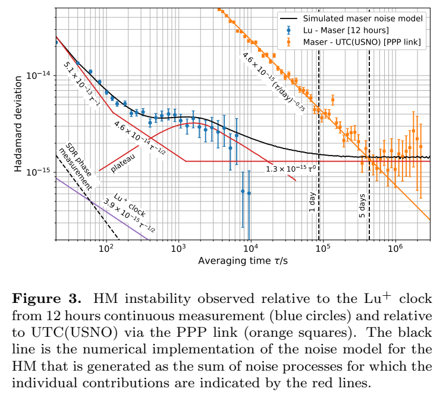
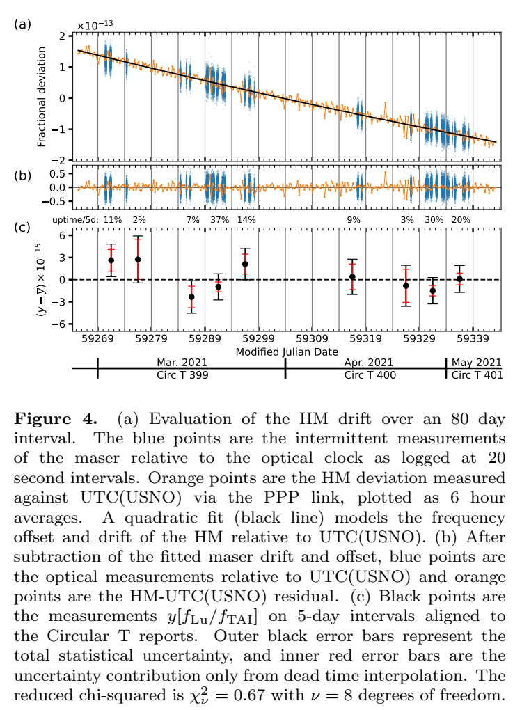
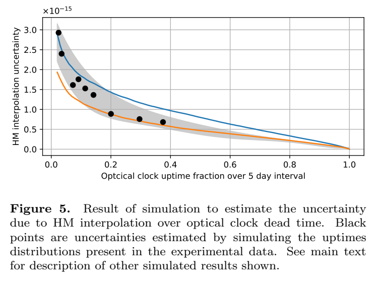
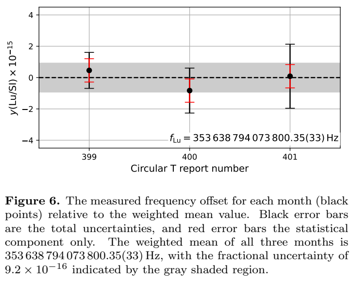

# `176Lu+ (3D1)` 光频标绝对频率测量论文解读

本文解读论文 *Absolute frequency measurement of a Lu+ (3D1) optical frequency standard via link to international atomic time*，面向第一次接触单离子光钟、光频梳、GNSS 时间传递、TAI 和不确定度预算的读者。

论文报告的最终结果是

$$
f_{\mathrm{Lu}}=353\,638\,794\,073\,800.35(33)\ \mathrm{Hz},
$$

相对不确定度为 $9.2\times10^{-16}$。括号中的 `(33)` 表示绝对标准不确定度约为 $0.33\ \mathrm{Hz}$。

## 0. 文档定位与阅读目录

| 文件 | 用途 |
| --- | --- |
| `lu3d1_absolute_frequency_explained.md` | 当前主解说：解释论文的图、公式、表格、物理意义和结论边界 |
| `reproduction_guide.md` | 复现手册：数据需求、计算流水线、符号约定、检查点和不可复现边界 |
| `lu3d1_absolute_frequency_feedback.md` | 审核反馈：记录本轮修订的验收依据 |
| `assets/paper_figures/figure_1.png` 至 `figure_6.png` | 从原论文 PDF 裁出的 Figure 1-6 |
| `2502.10004v3.pdf` | 原始论文 PDF |

推荐阅读顺序：先读第 1-4 节建立全局路线，再读第 5-13 节理解公式、实验和数据处理，最后读第 14-18 节理解结果、局限与术语。如果要动手复算，再转到 `reproduction_guide.md`。

最重要的复现边界是：仅凭论文 PDF 和公开 Circular T/CDDIS 数据，不能独立复算中心值 `353 638 794 073 800.35 Hz`。作者未公开完整 Lu/HM 时间序列、本地 RINEX、光钟 uptime 时间戳和部分系统评估原始记录；论文说明相关数据可向通讯作者合理请求。

## 1. 一句话看懂论文

作者把单个 `176Lu+` 离子的光学跃迁频率，经过

```text
Lu+ 离子 -> 钟激光 -> 光频梳 -> 本地氢钟 HM
-> GPS/PPP -> UTC(USNO) -> TAI -> SI 秒
```

这条链路测成了一个以 SI 秒为单位的绝对频率。

这里真正困难的不是“数出一个很大的频率”，而是证明每一段频率比、时间窗口、频移修正和不确定度都能接起来，并且没有把光钟停机、远程时间传递或跨月相关误差漏掉。

## 2. 为什么这件事重要：PFS、SFS、SRS 不是一回事

- **PFS（primary frequency standard，主频标）**：直接实现当前基于 `133Cs` 跃迁的 SI 秒定义。
- **SFS（secondary frequency standard，次级频标）**：经认可后，可用另一种原子跃迁校准 TAI。
- **SRS（secondary representation of the second，秒的次级表示）**：CIPM 推荐频率列表中对 SI 秒的次级表示；它是推荐频率和制度地位，不等于某一台设备天然就是 SFS。

对一个新光钟体系，至少要区分三个性能问题：

1. **稳定度**：重复测量在不同平均时间上散布多大。
2. **系统不确定度**：已知环境扰动和模型不完善还可能留下多大偏差。
3. **绝对频率测量**：能否把频率值可靠地溯源到 SI 秒。

`176Lu+` 的装置系统不确定度可以很低，但这并不自动给出绝对频率。本文的贡献是首次完成 `1S0 -> 3D1` 光频标的绝对频率测量，为建立 CIPM 推荐值提供必要输入。

## 3. 必要的基础知识

### 3.1 为什么光学频率有优势，但不保证天然更准

光学跃迁频率约为 $10^{14}\ \mathrm{Hz}$。高载频通常允许更高品质因数 $Q=\nu/\Delta\nu$ 和更细的相对频率分辨能力，但最终性能仍取决于线宽、相干时间、信噪比、原子数、局域振荡器噪声、询问占空比和系统频移。把它类比成“刻度更密的尺”是有用的，但尺是否准确还要看刻线和读数过程。

### 3.2 从时钟读数、时间差到分数频率差

`【基础补充】` 时间频率文献经常把单位为弧度的电子相位和单位为秒的时间偏差都简称为 phase。为了避免混用，本文固定以下符号：

| 符号 | 名称 | 单位 | 本文中的作用 |
| --- | --- | --- | --- |
| $T_A(t)$ | 时钟 A 在参考时刻 $t$ 的读数 | s | 时钟实际显示的时间 |
| $x_A(t)=T_A(t)-t$ | A 相对参考时间的时间偏差 | s | 时间计量中的 time deviation |
| $\phi_A(t)$ | 电信号相对标称载波的相位偏差 | rad | SDR 直接记录或解调的量 |
| $\Delta x_{AB}=x_A-x_B$ | A 相对 B 的时间差 | s | PPP、Circular T 常见输出 |
| $y_A$ | A 相对标称值的分数频率偏差 | 1 | 描述 A 走快或走慢 |
| $y(A/B)=f_A/f_B-1$ | A 相对 B 的频率比偏差 | 1 | 论文频率链使用的量 |

若资料把单位为秒的 $\Delta x$ 称为 phase difference，本文会明确写成“已换算为秒的时间差”；只有 $\phi$ 表示弧度相位。

#### 3.2.1 时钟读数和严格频率比

取理想参考时间为 $t$：

$$
T_A(t)=t+x_A(t),\qquad T_B(t)=t+x_B(t).
$$

若 A 走得略快，$x_A(t)$ 会随时间增加。求导得到

$$
\frac{dT_A}{dt}=1+\dot x_A,\qquad
\frac{dT_B}{dt}=1+\dot x_B.
$$

恒定的时间 offset 本身不代表频率不同；只有 offset 随时间变化才代表钟速不同。当 A、B 的读数使用相同的秒单位时，严格频率比可写成

$$
\frac{f_A}{f_B}
=\frac{dT_A/dt}{dT_B/dt}
=\frac{1+\dot x_A}{1+\dot x_B},
$$

因此

$$
y(A/B)=\frac{f_A}{f_B}-1
=\frac{\dot x_A-\dot x_B}{1+\dot x_B}.
$$

#### 3.2.2 小偏差近似与符号方向

原子钟通常满足 $|\dot x_A|,|\dot x_B|\ll1$。定义 $\Delta x_{AB}=x_A-x_B$ 后，一阶近似为

$$
y(A/B)\approx\dot x_A-\dot x_B
=\frac{d\Delta x_{AB}}{dt}.
$$

所以 $\Delta x_{AB}$ 随时间上升表示 A 相对 B 走得更快。若软件输出的是 $\Delta x_{BA}=x_B-x_A$，结果整体多一个负号。这条式子是共同标称秒和小分数偏差下的一阶近似，不应脱离条件当成任意信号间的严格恒等式。

#### 3.2.3 有限窗口平均和多点拟合

论文处理的是 `20 s`、`30 s`、`6 h` 和 `5 d` 等有限时间数据。对 $[t_1,t_2]$，令 $\Delta T=t_2-t_1$，则

$$
\bar y(A/B)
=\frac{1}{\Delta T}\int_{t_1}^{t_2}y(A/B,t)\,dt
\approx
\frac{\Delta x_{AB}(t_2)-\Delta x_{AB}(t_1)}{\Delta T}.
$$

例如时间差在 5 天内增加 $0.20\ \mathrm{ns}$：

$$
\bar y(A/B)\approx
\frac{0.20\times10^{-9}}{5\times86400}
=4.63\times10^{-16}.
$$

若窗口内有许多数据点，通常拟合

$$
\Delta x_k=a+b(t_k-t_0)+\epsilon_k,
$$

在窗口内平均频率近似恒定时，$b\approx\bar y(A/B)$。端点差、普通最小二乘、加权拟合和考虑相关噪声的拟合可能给出不同不确定度；HM 有 drift 和 aging 时，80 天全局模型更不能只用一条直线。

#### 3.2.4 弧度电子相位如何换成频率偏差

对标称频率 $f_0$ 的单载波

$$
V(t)=V_0\cos\left[2\pi f_0t+\phi(t)\right],
$$

瞬时频率为

$$
f(t)=f_0+\frac{1}{2\pi}\frac{d\phi}{dt},
$$

因此

$$
y(t)=\frac{f(t)-f_0}{f_0}
=\frac{1}{2\pi f_0}\frac{d\phi}{dt}.
$$

若定义等效时间偏差

$$
x(t)=\frac{\phi(t)}{2\pi f_0},
$$

才有 $y=dx/dt$。这里采用 $\cos(2\pi f_0t+\phi)$ 的正号约定；若接收机或软件定义为 $-\phi$，结果整体反号。这组公式只完成“某一标称载波的弧度相位 -> 该载波频率偏差”的转换；它还不能直接把 `20 MHz` 拍频变成 Lu/HM，因为中间还有混频符号、倍频系数和光频梳传递关系。

### 3.3 独立不确定度、相关不确定度和加权平均

`【基础补充】` 互相独立的标准不确定度按平方和合成：

$$
u=\sqrt{u_1^2+u_2^2+\cdots}.
$$

对互不相关的月度估计 $x_i$，常用权重 $w_i=1/u_{A,i}^2$：

$$
\bar x=\frac{\sum_i w_i x_i}{\sum_i w_i},\qquad
u_A(\bar x)=\frac{1}{\sqrt{\sum_i w_i}}.
$$

跨月相关的系统项不能当成三份独立噪声重复平均；本文把相关系统分量在最终结果中只计一次。

### 3.4 Hadamard deviation 为什么适合有漂移的钟

`【基础补充】` 对等间隔分数频率平均值 $\bar y_k$，非重叠 Hadamard deviation 的基本形式为

$$
\sigma_H(\tau)=\sqrt{\frac{1}{6}\left\langle
(\bar y_{k+2}-2\bar y_{k+1}+\bar y_k)^2
\right\rangle}.
$$

二阶差分会抑制恒定频率 offset 和线性频率漂移，因此在氢钟存在长期漂移时，比直接看普通方差更容易分辨随机噪声。

## 4. 论文的两条流：实验信号流与计量溯源流



**来源**：原论文 Figure 2，PDF 第 3 页。中文图题：Lu+ 光钟到国际原子时和 SI 秒的远程频率比较链路。

Figure 2 同时画了两种不同的“流”：

1. **实验信号流**：Lu 离子稳定钟激光；钟激光与光频梳拍频；梳的射频输出与自由运行氢钟比较；SDR 连续记录约 `20 MHz` 信号相位。
2. **计量溯源流**：本地 HM 参考 GPS 接收机，远端 USN7 接收机参考 UTC(USNO)；双方 RINEX 文件经 Bernese PPP 得到以秒表示的 HM-UTC(USNO) 时间差；Circular T 再把 UTC(USNO) 接到 TAI 和 SI 秒。

图中的责任边界也很重要：

- **clock laboratory**：Lu 离子、钟激光、光频梳、HM、SDR、本地 GPS 接收机和本地 RINEX。
- **remote laboratory**：USN7 GPS 接收机、由 CDDIS 获取的远端 RINEX、UTC(USNO)。
- **BIPM**：事后计算并发布 Circular T，给出 UTC(k)-UTC/TAI 相位数据以及 TAI 标度间隔相对 SI 秒的校准。

本地 SDR 是连续实时测量；PPP 使用本地和远端 GNSS 文件事后处理；Circular T 也是事后发布。GPS/PPP 并未直接比较 Lu+ 与 TAI，而是先比较 HM 与 UTC(USNO)。

**这张图回答的问题**：一个本地、间歇运行的光钟如何最终得到 SI 可溯源的 Hz 数值。

**对应内容**：第 8 节光频梳方程、第 10 节论文式 (3) 和式 (4)。

**不要这样读**：图中的箭头不是都代表实时锁定；特别是 TAI 不是实验室里可以直接接线的一台钟。

## 5. 公式总览

| 公式 | 论文位置 | 作用 | 来源标注 | 需要的背景 |
| --- | --- | --- | --- | --- |
| 式 (1) 超精细平均 | Eq. (1)，PDF 第 2 页，Figure 1 | 定义 Lu 标准频率 | `【论文给出】` + `【由图推出】` | 能级频差、相位累积 |
| 式 (2) 量子投影噪声稳定度 | Eq. (2)，PDF 第 3 页 | 估算光钟运行时统计稳定度 | `【论文给出】` | Ramsey 对比度、独立采样平均 |
| 式 (3) SI 溯源链 | Eq. (3)，PDF 第 4 页，Figure 2 | 把 Lu/HM、PPP、TAI、SI 各段相乘 | `【论文给出】` + `【基础补充】` | 频率比望远镜相消、时间窗口 |
| 式 (4) 卫星链路不确定度 | Eq. (4)，PDF 第 7 页 | 把时间传递时间差不确定度换成 5 天频率不确定度 | `【论文给出】` + `【由上式代入】` | 端点协方差、量纲换算 |

后文还会推导二阶塞曼、引力红移、hyper-Ramsey 剩余光移、相位到频率、加权平均和约化卡方。

## 6. Lu+ 光钟如何定义：Figure 1 与论文式 (1)



**来源**：原论文 Figure 1，PDF 第 2 页。中文图题：`176Lu+` 能级结构、钟询问耦合与超精细平均时序。

### 6.1 Figure 1(a)：能级和波长

- `646 nm`：论文正文明确用于每轮实验开始时的 Doppler 冷却。
- `848 nm`：`1S0 -> 3D1` 钟跃迁，也是 Ramsey/hyper-Ramsey 光脉冲的波长。
- `804 nm`：论文第 3.3 节明确用于边带谱测量和过剩微运动评估，对应另一条窄跃迁。
- `350 nm`：论文讨论部分明确称为 repump 光，由 `701 nm` 倍频产生；其 mode hopping 是开机率中断的重要来源。
- `622 nm`、`895 nm` 以及图中其他辅助连线：展示冷却、态制备、探测和清空亚稳态所需的辅助能级网络，但本论文没有逐条给出操作步骤；具体用途属于论文引用 [8] 的装置背景，不能只凭箭头猜测。

### 6.2 Figure 1(b)：四个状态和三种耦合

论文定义

$$
|g\rangle=|{}^1S_0,F=7,m_F=0\rangle,
$$

$$
|8\rangle=|{}^3D_1,8,0\rangle,\quad
|7\rangle=|{}^3D_1,7,0\rangle,\quad
|6\rangle=|{}^3D_1,6,0\rangle.
$$

电子项符号后的两个数分别是总角动量量子数 $F$ 和磁量子数 $m_F$。选择 $m_F=0$ 可消除一阶 Zeeman 频移；再让 $F=6,7,8$ 三态等有效时间参与平均，可构造近似有效 $J=0$ 的参考，强烈抑制二阶 Zeeman 和 rank-2 张量相互作用（包括电四极矩频移）。这里的 “practically eliminates” 不等于严格为零：表 1 仍报告残余二阶 Zeeman shift $-140.7\times10^{-18}$。

光学角频率 $\omega_L$ 连接 $|g\rangle\leftrightarrow|8\rangle$；微波 $\omega_1$ 连接 $|8\rangle\leftrightarrow|7\rangle$；微波 $\omega_2$ 连接 $|7\rangle\leftrightarrow|6\rangle$。普通频率与角频率的关系是 $\nu_L=\omega_L/(2\pi)$、$f_k=\omega_k/(2\pi)$。

### 6.3 Figure 1(c)：从左到右读脉冲时序

1. 第一个 `848 nm` $\pi/2$ 脉冲把 $|g\rangle$ 与 $|8\rangle$ 建立相干叠加。
2. 微波 $\pi$ 脉冲依次把激发态分量从 $|8\rangle$ 转到 $|7\rangle$、再转到 $|6\rangle$。
3. 中间反向微波脉冲把分量送回 $|7\rangle$、$|8\rangle$。
4. 序列末端加入额外 `848 nm` $\pi$ 脉冲，并相移 $180^\circ$，构成 hyper-Ramsey 抑制剩余探测光移。
5. 最后一个 $\pi/2$ 脉冲把相位差转换成可测的态布居差。

论文参数为

$$
\tau_L=1.4\ \mathrm{ms},\qquad \tau_1=\tau_2=2\ \mathrm{ms},
$$

$$
T_R=3(T+\tau_1+\tau_2)=42\ \mathrm{ms},
$$

所以 $T=10\ \mathrm{ms}$。图中的 $T/2$、$\tau_1$、$\tau_2$ 和端点半脉冲经过对称排列，使原子相位在 $F=8,7,6$ 三个超精细态中的有效驻留时间相同。

### 6.4 论文式 (1) 的逐步推导

**来源标注**：`【论文给出】` 状态和最终公式；`【由图推出】` 下面的频差关系。

先区分“原子自身的共振频差”和“实验施加的振荡器频率”。若 $f_{1,\mathrm{res}}$、$f_{2,\mathrm{res}}$ 表示裸原子的两段超精细共振频差，则 Figure 1(b) 给出

$$
\nu_7=\nu_8+f_{1,\mathrm{res}},\qquad
\nu_6=\nu_8+f_{1,\mathrm{res}}+f_{2,\mathrm{res}}.
$$

因此三条裸光学跃迁的平均是

$$
\frac{\nu_8+\nu_7+\nu_6}{3}
=\nu_8+\frac{2f_{1,\mathrm{res}}+f_{2,\mathrm{res}}}{3}.
$$

`【合理推断】` 论文说明 Figure 1(c) 的对称时序让三个 $F$ 态贡献相同的有效相位，但没有逐行写出相位代数。把中央 Ramsey fringe 的总相位条件展开，可写成

$$
3\nu_L+2f_1+f_2=\nu_8+\nu_7+\nu_6.
$$

两边除以 3，得到论文式 (1)：

$$
f_{\mathrm{Lu}}
=\frac{\nu_8+\nu_7+\nu_6}{3}
=\nu_L+\frac{2f_1+f_2}{3}.
$$

在光学和微波都恰好共振的特例中，$\nu_L=\nu_8$、$f_1=f_{1,\mathrm{res}}$、$f_2=f_{2,\mathrm{res}}$，可直接从裸能级频差看出同一结果。微波存在小失谐时，则不能逐项使用这些等号；正确依据是整段相干序列的相位闭合条件。

论文所说的“不完全共振仍成立”也不是“任意失谐都无影响”：它依赖指定的相干转移序列、校准的脉冲面积、对称时序和锁定在中央 Ramsey fringe。微波耦合误差仍作为表 1 的不确定度项评估。

**这张图支持的结论**：Lu 参考不是随意平均三条谱线，而是在一次相干询问中实现等时间超精细平均。

**不要这样读**：Figure 1(c) 不是只有两个光脉冲的普通 Ramsey 序列；中间的微波转移和额外相位翻转光脉冲是公式成立及抑制光移的关键。

## 7. Ramsey 伺服与论文式 (2)

每个 cycle 把完整序列重复两次，首个 $\pi/2$ 脉冲的相位分别取 $+90^\circ$ 和 $-90^\circ$。这相当于在中央 Ramsey fringe 两侧采样。两次激发概率之差形成有正负号的频率误差信号；每 $N=25$ 个 cycle、即 $t_u=3.6\ \mathrm{s}$ 更新一次 `848 nm` 激光频率。

### 7.1 量子投影噪声稳定度

**来源标注**：`【论文给出】` Eq. (2)，PDF 第 3 页。

$$
\sigma_y(\tau)=
\frac{1}{f_{\mathrm{Lu}}}
\frac{1}{2\pi C T_R\sqrt{2N}}
\sqrt{\frac{t_u}{\tau}}
\approx
\frac{3.9\times10^{-15}}{\sqrt{\tau/\mathrm{s}}},
\qquad \tau\gg t_u.
$$

符号含义：

- $C\approx0.75$：$T_R=42\ \mathrm{ms}$ 时的 Ramsey fringe 对比度。
- $T_R$：相位有效积累时间。
- $N=25$：一次伺服更新包含的 cycle 数。
- $\sqrt{2N}$：每个 cycle 有两次 $\pm90^\circ$ 相位询问，因此一次更新累计 $2N$ 次二元量子测量。
- $t_u=3.6\ \mathrm{s}$：一次更新所需时间，包含询问、冷却、态制备和探测。
- $\tau$：总平均时间，公式要求它远长于单次更新周期。

这条式子说明理想独立统计噪声按 $1/\sqrt{\tau}$ 下降。表 2 的 `Lu clock` 行就是把光钟实际 uptime 代入这一稳定度模型得到的统计贡献；它只有 $0.2$ 到 $0.8\times10^{-16}$，远小于 HM 插值和卫星链路项。

### 7.2 hyper-Ramsey 剩余光移

**来源标注**：`【论文给出】` 第 3.3 节的近似式。

$$
\delta\nu_{\mathrm{HR}}
=\frac{2}{\pi T_R}\left(\frac{\Delta}{\Omega}\right)^3,
\qquad
\Omega=\frac{\pi}{\tau_L}.
$$

$\Delta$ 是钟脉冲期间补偿 ac-Stark shift 的频率步进误差，$\Omega$ 是光学 Rabi 角频率。三次方意味着小的补偿误差会被强烈压低。论文在运行前用 hyper-Ramsey 与 Rabi 光谱交错比较，把 ac-Stark shift 评估到约 `1%`；考虑运行期间激光强度变化，最终按 `5%` 的步进误差估计表 1 中 `848 nm ac-Stark` 的 $1.2\times10^{-18}$ 不确定度。

## 8. 光频梳和 SDR：如何比较 353 THz 与 10 MHz

`【基础补充】` 光频梳第 $n$ 根梳齿满足

$$
\nu_n=n f_r+f_o,
$$

所以钟激光一般写成

$$
\nu_L=n f_r+f_o\pm f_{\mathrm{beat}}\pm f_{\mathrm{offsets}}.
$$

$n$ 是约百万量级的梳齿编号；拍频和电子 offset 的正负号必须由实际锁相配置确定，不能只凭公式猜测。

本文中：

- 光学拍频锁使重复频率 $f_r\approx250\ \mathrm{MHz}$ 跟随 Lu 稳定的钟激光。
- 载波包络偏移 $f_o$ 锁到 HM。
- HM 的 `10 MHz` 经锁相倍频到 `980 MHz = 98\times10 MHz`。
- $4f_r$ 约为 `1 GHz`；它与 `980 MHz` 混频得到约 `20 MHz`。
- SDR 零死时间记录该 `20 MHz` 信号的弧度相位 $\phi_{20}(t)$。

为了展示传递关系，可先**人为固定**一个带符号约定：

$$
f_{20}=4f_r-98f_{\mathrm{HM}}.
$$

于是相位斜率给出的不是直接的 Lu/HM，而是

$$
\frac{1}{2\pi}\frac{d\phi_{20}}{dt}
=\delta f_{20}
=4\,\delta f_r-98\,\delta f_{\mathrm{HM}}.
$$

如果实际混频器或 SDR 保存的是 $98f_{\mathrm{HM}}-4f_r$，整式反号。再对光频梳方程求变化量：

$$
\delta\nu_L
=n\,\delta f_r+\delta f_o
\pm\delta f_{\mathrm{beat}}
\pm\delta f_{\mathrm{offsets}}.
$$

只有把 $\delta f_r$、$f_o$、光学 beat、DDS/EOM offset 以及它们对 HM 的参考关系一起代入，才能得到 $y(\mathrm{Lu/HM})$。换一种无量纲写法，令 $r_r=f_r/f_{\mathrm{HM}}$，则

$$
\frac{f_{20}}{f_{\mathrm{HM}}}=4r_r-98,
$$

而 $\nu_L/f_{\mathrm{HM}}$ 还需要 $n$、$f_o/f_{\mathrm{HM}}$、beat 和所有 offset 的带符号系数。

**复现边界**：论文公开了链路结构，但没有公开 comb tooth index、DDS/beat 全部正负号、SDR 相位定义和完整 transfer equation。因此可以从 $\phi_{20}$ 推到带符号拍频变化，也能说明它如何约束 $f_r$；不能仅凭论文文字唯一恢复从每个 SDR 样本到最终 Lu/HM 的完整比例系数，更不能简单“除以 20 MHz”。

论文报告光钟 uptime 内没有观察到 comb cycle slip。跳错一根梳齿会使 $n$ 或拍频分支发生离散错误，远大于 $10^{-16}$ 目标，所以必须靠连续相位和独立计数检查排除。

## 9. 自由运行氢钟：不是“被光钟校准”的钟

正确的实验描述是：

```text
光钟运行时，连续测量 Lu+ 光钟相对自由运行 HM 的频率差；
光钟停机时，用 HM 保持频率连续性；
再用 HM 实际数据、漂移模型和噪声模拟评估
从真实 uptime 平均 T1 到完整五天平均 T2 的插值不确定度。
```

论文没有说作者把 HM 实时驯服到 Lu+ 上。HM 是 flywheel，不是被连续反馈控制的从钟。



**来源**：原论文 Figure 3，PDF 第 5 页。中文图题：氢钟相对 Lu 光钟和 UTC(USNO) 的不稳定度及模拟噪声模型。

### 9.1 如何读 Figure 3

- 横轴是平均时间 $\tau$（秒，对数坐标）；纵轴是无量纲 Hadamard deviation。
- 蓝色圆点是最长 `12 h` 连续 Lu/HM 比值数据；它包含 Lu、HM 和测量链贡献，不能称为“纯 Lu 噪声”。
- 橙色方点是 PPP 得到的 HM-UTC(USNO)，适用于更长时间尺度。
- 黑线是后续 Figure 5 蒙特卡洛使用的总 HM 噪声模型。
- 红线分别表示白相位噪声、白频率噪声、闪烁频率噪声和额外 `plateau` 分量。
- $\tau^{-1}$ 斜率对应白相位噪声；$\tau^{-1/2}$ 对应白频率噪声；约 $1.3\times10^{-15}$ 的水平底对应闪烁频率噪声。
- `5-60 min` 的平台不能只用简单幂律噪声解释，作者用低通白频率噪声构造额外 plateau。

论文用于模拟的三项显式幂律幅度为

$$
5.1\times10^{-13}(\tau/\mathrm{s})^{-1},\qquad
4.6\times10^{-14}(\tau/\mathrm{s})^{-1/2},\qquad
1.3\times10^{-15},
$$

分别对应白相位、白频率和闪烁频率噪声；另外再加入低通 plateau 项。图中的黑色虚线标出 SDR 相位测量约 $3\times10^{-14}(\tau/\mathrm{s})^{-1}$ 的贡献，紫线则是式 (2) 给出的 Lu 光钟 $3.9\times10^{-15}(\tau/\mathrm{s})^{-1/2}$ 估计。两者提醒读者：蓝点同时含光钟、HM 和测量链噪声。

约 5 天后 HM-UTC(USNO) 达到 $1.3\times10^{-15}$ 附近的平台，论文把它归因于 HM。Figure 3 的作用不是装饰性展示稳定度，而是为 Figure 5 的 dead-time 模拟确定噪声参数。

**不要这样读**：蓝点不是纯光钟极限；黑线也不是直接从一条理论定律推出，而是与观测相容的复合噪声模型。

## 10. 从 Lu 到 SI：论文式 (3) 与式 (4)

### 10.1 原始输出、单位和目标量

| 环节 | 原始输出 | 原始单位 | 目标量 | 转换重点 |
| --- | --- | --- | --- | --- |
| SDR | $\phi_{20}(t)$ | rad | $y(\mathrm{Lu/HM})$ | $2\pi$、混频符号、倍频与梳齿系数 |
| PPP | $\Delta x_{\mathrm{PPP}}=x(\mathrm{HM})-x(\mathrm{USNO})$ | s | $y(\mathrm{HM/UTC(USNO)})$ | 时间差斜率及相关噪声 |
| Circular T part 1 | $C_k=UTC-UTC(k)$ | ns | $y(UTC(k)/TAI)$ | 5 天差分并改变方向 |
| Circular T part 3 | 标度间隔偏差 $d$ | 分数值 | $y(TAI/SI)$ | 周期与频率互为倒数产生负号 |

四项输入都可能被口语化地称为“相位”，但它们的单位、符号和缩放关系不同。

### 10.2 三个时间集合

- $T_1$：某个 5 天窗口内所有 Lu 实际 uptime 的集合，通常不是单个连续区间。
- $T_2$：与 Circular T 对齐的完整 5 天窗口。
- $T_3$：Circular T 399、400、401 各自约一个月的报告窗口。

$f_{A,T}$ 表示时标或频标 $A$ 在时间集合 $T$ 上的平均频率，不是瞬时频率。

### 10.3 论文式 (3)：频率比链

**来源标注**：`【论文给出】` Eq. (3)，PDF 第 4 页；`【基础补充】` 望远镜相消解释。

$$
\frac{f_{\mathrm{Lu}}}{f_{\mathrm{SI}}}
=
\frac{f_{\mathrm{Lu},T_1}}{f_{\mathrm{HM},T_1}}
\frac{f_{\mathrm{HM},T_1}}{f_{\mathrm{HM},T_2}}
\frac{f_{\mathrm{HM},T_2}}{f_{\mathrm{UTC(USNO)},T_2}}
\frac{f_{\mathrm{UTC(USNO)},T_2}}{f_{\mathrm{TAI},T_2}}
\frac{f_{\mathrm{TAI},T_2}}{f_{\mathrm{TAI},T_3}}
\frac{f_{\mathrm{TAI},T_3}}{f_{\mathrm{SI},T_3}}.
$$

如果每个量都在同一时间区间，分子分母会像望远镜一样相消。本文的难点正是 $T_1\ne T_2\ne T_3$，所以必须显式加入 HM interpolation 和 TAI interpolation 两项。

用小偏差 $y_i=f_i/f_{i+1}-1$ 表示，每段都约为 $1+y_i$，因此

$$
\prod_i(1+y_i)\approx1+\sum_i y_i.
$$

这里各 $y_i$ 约为 $10^{-13}$ 或更小，二阶交叉项约 $10^{-26}$，远低于目标不确定度，可以忽略。

### 10.4 PPP：30 s 时间差如何得到 HM/UTC(USNO)

`【论文给出】` Bernese PPP 每 `30 s` 估计

$$
\Delta x_{\mathrm{PPP}}(t)
=x(\mathrm{HM})-x(\mathrm{USNO}).
$$

USN7 接收机参考 UTC(USNO)，所以小偏差近似下

$$
y(\mathrm{HM/UTC(USNO)})
\approx\frac{d\Delta x_{\mathrm{PPP}}}{dt}.
$$

有限窗口中则使用端点差或多点斜率拟合：

$$
\bar y(\mathrm{HM/UTC(USNO)})
\approx
\frac{\Delta x_{\mathrm{PPP}}(t_2)-\Delta x_{\mathrm{PPP}}(t_1)}{t_2-t_1}.
$$

`30 s` 是 PPP 时间差输出间隔；Figure 4(a) 的橙点是进一步做 `6 h` 平均后的显示。固定硬件延迟只是常数 offset，求斜率时消失；随温度变化的延迟会变成频率误差。PPP 噪声具有时间相关性，不能把 30 s 点数简单开平方来估计 5 天不确定度。

### 10.5 Circular T：两个不同来源的负号

**来源标注**：`【论文给出】` Circular T 字段和所需频率链方向；`【基础补充】` 下面的导数与负号推导。

定义 Circular T part 1 的字段方向为

$$
C_k(t)=UTC(t)-UTC(k)(t).
$$

则

$$
\frac{dC_k}{dt}\approx y_{UTC}-y_{UTC(k)}.
$$

UTC 与 TAI 只相差整数闰秒，频率标度间隔相同，所以 $y_{UTC}=y_{TAI}$，所需方向满足

$$
y(UTC(k)/TAI)
\approx-\frac{dC_k}{dt},
$$

以及有限 5 天形式

$$
\bar y(UTC(k)/TAI)
\approx-
\frac{C_k(t_2)-C_k(t_1)}{t_2-t_1}.
$$

这是**字段方向负号**。如果实际读取的列是 `UTC(k)-UTC`，负号相反，复算时必须以报告字段定义为准。

另一个负号来自 Circular T part 3：$d$ 描述 TAI **标度间隔（周期）**相对 SI 秒的偏差，而频率与周期互为倒数，故一阶近似下

$$
y_{\mathrm{TAI/SI}}\approx-d.
$$

这是**周期倒数负号**，与 `[UTC-UTC(k)]` 的字段方向负号不是同一件事。

### 10.6 论文式 (4)：从一般传播式到推荐链路模型

**来源标注**：`【论文给出】` Eq. (4)，PDF 第 7 页。

由有限窗口公式

$$
\bar y\approx\frac{\Delta x(t_2)-\Delta x(t_1)}{\Delta T}
$$

作一般不确定度传播：

$$
u^2(\bar y)=
\frac{u_x^2(t_1)+u_x^2(t_2)
-2\operatorname{Cov}[x(t_1),x(t_2)]}{\Delta T^2}.
$$

只有在两个端点独立、且标准不确定度都为 $u_A$ 时，才化为

$$
u(\bar y)=\frac{\sqrt2\,u_A}{\Delta T}.
$$

`【论文给出】` 论文引用文献 [34] 的卫星链路推荐模型，把不同平均时间下的行为进一步参数化为

$$
u(\tau)=\frac{\sqrt{2}\,u_A}{\tau_0}
\left(\frac{\tau}{\tau_0}\right)^{-0.9}.
$$

- $u_A=0.2\ \mathrm{ns}$：Circular T 给出的 UTC(USNO) 时间传递时间差不稳定度。
- $\tau_0=5\ \mathrm{d}$：参考时间；本测量 $\tau=5\ \mathrm{d}$。
- $\sqrt2$ 可由独立等不确定度端点的差分理解。
- 指数 `-0.9` 不是从端点独立假设推导出来的，而是文献 [34] 的实际链路缩放模型。
- 时间差不确定度除以区间长度后，单位由秒变成无量纲分数频率。

代入 $5\ \mathrm{d}=432000\ \mathrm{s}$：

$$
u=\frac{\sqrt2\times0.2\times10^{-9}}{432000}
\approx6.55\times10^{-16},
$$

与表 2 的 `UTC(USNO)/TAI = 6.6e-16` 对应。本文恰好有 $\tau=\tau_0$，所以幂律缩放因子为 1。

## 11. 系统频移和符号：论文 Table 1

**来源**：原论文 Table 1，PDF 第 4 页。表中数字是论文报告的物理 **shift**，单位 $10^{-18}$；若要从受扰动实测频率恢复无扰动频率，施加的 correction 通常取相反号。必须在具体计算代码中明确是“加 shift”还是“减 shift”。

| 效应 | 论文 shift | 标准不确定度 | 含义 |
| --- | ---: | ---: | --- |
| Quadratic Zeeman | `-140.7` | `0.6` | 残余二阶磁场频移 |
| Excess micromotion | `-0.2` | `0.2` | Paul 阱受驱微运动的时间膨胀 |
| Second-order Doppler | `-0.1` | `0.1` | 热运动时间膨胀 |
| ac-Zeeman (rf) | `0.2` | `<0.1` | 阱射频磁场影响 |
| ac-Zeeman (microwave) | `-8.0` | `6.2` | 微波偏振不平衡 |
| Microwave coupling | `0.0` | `3.7` | 微波脉冲面积误差导致平均不完美 |
| ac-Stark (848 nm) | `0.0` | `1.2` | 钟脉冲剩余光移 |
| Blackbody radiation | `-1.6` | `0.3` | 环境热辐射频移 |
| Lu 装置小计 | `-150.4` | `7.3` | 装置内部系统项 |
| Gravitational shift | `1718` | `36` | 实验高度相对大地水准面的红移 |
| 含重力总计 | `1568` | `37` | 总 shift |

对 `<0.1`，复算平方和时可保守按上限 `0.1` 处理；这样装置内部不确定度约为

$$
\sqrt{0.6^2+0.2^2+0.1^2+0.1^2+6.2^2+3.7^2+1.2^2+0.3^2}
\approx7.3.
$$

`7.3e-18` 换成表 3 使用的 `1e-16` 单位是 `0.073e-16`，四舍五入为 `0.1e-16`。引力 shift 很大，不代表其不确定度也同样大；论文强调只有二阶 Zeeman 和引力两项的修正在 $10^{-17}$ 以上且统计显著。

### 11.1 二阶 Zeeman shift

**来源标注**：`【论文给出】` 系数和磁场；`【由上式代入】` 数值换算。

$$
\delta\nu_Z=k_ZB^2,
$$

其中 $k_Z=-4.89264(88)\ \mathrm{Hz/mT^2}$，$B=0.10084(20)\ \mathrm{mT}$。代入：

$$
\delta\nu_Z\approx-4.89264\times(0.10084)^2\ \mathrm{Hz}
=-49.75\ \mathrm{mHz}.
$$

再除以载频：

$$
\frac{\delta\nu_Z}{f_{\mathrm{Lu}}}
\approx\frac{-0.04975}{3.536387940738\times10^{14}}
=-140.7\times10^{-18}.
$$

### 11.2 引力红移

**来源标注**：`【论文给出】` 第 3.2 节；`【基础补充】` 高程术语。

近地面近似为

$$
\frac{\Delta f}{f}=\frac{gh}{c^2},\qquad h=H-N.
$$

$H=23.68(10)\ \mathrm{m}$ 是相对 WGS84 椭球的椭球高，$N=7.89(10)\ \mathrm{m}$ 是大地水准面起伏，$h=15.79\ \mathrm{m}$ 是相对大地水准面的正高。用 $g=9.7803(3)\ \mathrm{m/s^2}$ 代入：

$$
\frac{gh}{c^2}\approx1.72\times10^{-15}.
$$

位置更高的钟相对大地水准面走得更快，因此论文报告正的 gravitational shift。$0.04\times10^{-15}$ 不确定度还包含为潮汐调制潜在偏差预留的分量。

## 12. 原始数据如何变成 5 天结果：Figure 4

测量本体位于 MJD `59270-59338`（2021-02-25 至 2021-05-04 UTC）；为与 Circular T 的 5 天网格对齐，统计窗口扩展到 MJD `59269-59339`（2021-02-24 至 2021-05-05 UTC）。所有边界按 UTC/MJD，而不是本地时区切分。



**来源**：原论文 Figure 4，PDF 第 6 页。中文图题：80 天氢钟漂移模型、残差和与 Circular T 对齐的 5 天频率结果。

### 12.1 Figure 4(a)：拟合 HM offset、linear drift 和 aging

- 蓝点：光钟运行时记录的 HM relative to optical clock，`20 s` 一点。
- 橙点：PPP 得到的 HM-UTC(USNO)，图中按 `6 h` 平均。
- 黑线：约 `80 d` 数据的二次频率模型。

术语必须分开：

- **offset**：参考时刻的频率偏差。
- **linear drift**：频率随时间的一阶变化，约 $-3.7\times10^{-15}/\mathrm{d}$。
- **aging**：漂移率本身的长期变化，论文给出 $4.6\times10^{-15}/\mathrm{d}/\mathrm{year}$；在 80 天区间里表现为频率的二次项。
- **diurnal**：与昼夜温度等因素相关的周期项，不属于二次 aging。

只用直线不能完全描述 80 天 HM 漂移，因此论文加入二次项。

### 12.2 Figure 4(b)：扣除拟合模型后的残差和负号

黑色模型中的 frequency offset、linear drift 和 quadratic aging 一起从本地观测中扣除。橙点成为 HM-UTC(USNO) residual；蓝点被换算到光钟相对 UTC(USNO) 的组合量。

**来源标注**：`【论文给出】` Figure 4(b) 的数据方向和 $-y(\mathrm{Lu/UTC(USNO)})$ 写法；`【基础补充】` 下面的一阶频率比代数。

若本地蓝点原始方向记作 $y(\mathrm{HM/Lu})$，PPP 橙点方向为 $y(\mathrm{HM/UTC})$，则小偏差链为

$$
y(\mathrm{Lu/UTC})
\approx y(\mathrm{Lu/HM})+y(\mathrm{HM/UTC}),
$$

而

$$
y(\mathrm{Lu/HM})\approx-y(\mathrm{HM/Lu}),
$$

所以

$$
y(\mathrm{Lu/UTC})
\approx-y(\mathrm{HM/Lu})+y(\mathrm{HM/UTC}).
$$

论文正文把 Figure 4(b) 蓝点写作 $-y(\mathrm{Lu/UTC(USNO)})$；按上式再整体取负，结构为 $y(\mathrm{HM/Lu})-y(\mathrm{HM/UTC})$。这解释了为什么漂移模型和 PPP 项的扣除方向不能凭图形直觉决定。

论文没有公开每个本地数据列、SDR 相位累加器和处理脚本的完整 sign convention，因此这里给出的是符号代数结构，而不是对未公开代码的逐行还原。实际复算必须从原始列定义逐项验证。

### 12.3 Figure 4(c)：5 天分箱、两层误差棒和卡方

- 黑点：与 Circular T 对齐的 9 个 5 天 $y(f_{\mathrm{Lu}}/f_{\mathrm{TAI}})$ 结果相对平均值的偏差。
- 外层黑色误差棒：表 2 中所有统计项的平方和。
- 内层红色误差棒：只表示 HM dead-time interpolation；不是总误差。
- 图上 `11%, 2%, ...` 与表 2 的 `Lu uptime` 行逐一对应。
- 没有任何 Lu 数据的 5 天窗口不会出现在表 2 或黑点中，但它们仍会在从 5 天结果到月度 TAI 平均时形成 TAI interpolation dead time。

`【基础补充】` 约化卡方为

$$
\chi_\nu^2=\frac{1}{\nu}\sum_i\frac{(x_i-\bar x)^2}{u_i^2}.
$$

Figure 4(c) 给出 $\chi_\nu^2=0.67$、自由度 $\nu=8$。它检查 9 个 5 天点的散布是否与给定统计不确定度相容；小于 1 表示未发现额外散布，但不证明所有系统偏差都不存在。

**三步对应关系**：Figure 4(a) 拟合漂移 -> Figure 4(b) 扣除漂移 -> Figure 4(c) 5 天分箱并接到 TAI。

**不要这样读**：Figure 4(b) 的蓝点经过符号翻转；Figure 4(c) 红误差棒不是总统计误差。

## 13. HM 插值模拟与运行调度：Figure 5

作者不是用模拟轨迹生成一条唯一的“缺失数据补值”。实际 HM 观测和漂移模型给出频率链中心值，蒙特卡洛模拟只评估从实际 uptime 集合 $T_1$ 推到完整 5 天 $T_2$ 时的随机不确定度。

模拟步骤：

1. 用 FFT 方法分别生成白相位、白频率、闪烁频率和低通 plateau 噪声。
2. 对每个实际 uptime mask 生成约 $2\times10^3$ 条 5 天 HM 轨迹。
3. 每条轨迹分别计算 $T_1$ 上平均和完整 $T_2$ 上平均。
4. 两种平均之差的标准差就是 HM interpolation uncertainty。



**来源**：原论文 Figure 5，PDF 第 7 页。中文图题：光钟 dead time 分布对 HM 插值不确定度的影响。

- 横轴：5 天内 optical-clock uptime fraction。
- 纵轴：HM interpolation uncertainty，倍率为 $10^{-15}$。
- 黑点：实验中真实 uptime 时间分布对应的模拟结果，不只由总百分比决定。
- 灰色带：总 uptime 固定、每段连续运行限制为 `1-12 h` 时，随机安排运行时刻得到的范围。
- 蓝线：所有 uptime 集中为 5 天中央的一段连续运行。
- 橙线：相同 uptime 分成五段并均匀散布。

分散且均匀的采样通常比集中在一段更能约束整个 5 天 HM 平均值。因此核心结论不仅是“uptime 越高越好”，还包括“uptime 在窗口内如何分布同样重要”。黑点数值进入表 2 的 `HM interpolation` 行。

论文没有公开完整 uptime mask、plateau 低通截止频率和全部模拟实现参数，所以外部读者能复现方法与量级，不能严格重现 Figure 5 黑点。

**不要这样读**：相同 uptime 百分比不保证相同不确定度。

### 13.1 drift、aging 和 diurnal 的误差角色

论文没有观察到确定的昼夜周期振幅，只能给出 `<1e-15` 的上限。由于光钟 uptime 更多落在白天，若真实周期项达到该上限，最终平均可能偏约 `5e-16`；论文把它作为系统不确定度，而不是已经测得并施加的 correction。HM drift 模型的不确定度跨全部测量相关，也不会随月数按独立噪声下降。

## 14. 完整统计预算：Table 2 与 Table 3

### 14.1 Table 2：9 个有 Lu 数据的 5 天窗口

**来源**：原论文 Table 2，PDF 第 8 页。所有不确定度单位为 $10^{-16}$。

| MJD start | 59269 | 59274 | 59284 | 59289 | 59294 | 59314 | 59324 | 59329 | 59334 |
| --- | ---: | ---: | ---: | ---: | ---: | ---: | ---: | ---: | ---: |
| MJD stop | 59274 | 59279 | 59289 | 59294 | 59299 | 59319 | 59329 | 59334 | 59339 |
| UTC 日期 | 02-24/03-01 | 03-01/03-06 | 03-11/03-16 | 03-16/03-21 | 03-21/03-26 | 04-10/04-15 | 04-20/04-25 | 04-25/04-30 | 04-30/05-05 |
| Lu uptime | 11% | 2% | 7% | 37% | 14% | 9% | 3% | 30% | 20% |
| Lu clock | 0.4 | 0.8 | 0.5 | 0.2 | 0.4 | 0.4 | 0.7 | 0.2 | 0.3 |
| HM interpolation | 15 | 29 | 16 | 6.8 | 14 | 18 | 24 | 7.6 | 8.8 |
| HM/UTC(USNO) | 15 | 15 | 15 | 15 | 15 | 15 | 15 | 15 | 15 |
| UTC(USNO)/TAI | 6.6 | 6.6 | 6.6 | 6.6 | 6.6 | 6.6 | 6.6 | 6.6 | 6.6 |
| Lu/TAI Total | 22 | 33 | 23 | 18 | 21 | 24 | 29 | 18 | 19 |

每列 `Total` 是四项统计不确定度的平方和。例如 uptime 只有 `2%` 的第二列：

$$
\sqrt{0.8^2+29^2+15^2+6.6^2}\approx33.
$$

表中缺少 MJD `59279-59284`、`59299-59314`、`59319-59324` 等没有 Lu 观测的窗口；这些空窗不产生 5 天 Lu/TAI 点，却会影响月度 TAI interpolation。

### 14.2 Table 3：三个 Circular T 月度估计与最终合并

**来源**：原论文 Table 3，PDF 第 8 页。单位为 $10^{-16}$。

| 不确定度来源 | Cir. T 399 | Cir. T 400 | Cir. T 401 | Total |
| --- | ---: | ---: | ---: | ---: |
| **统计分量 $\mu_A$** | | | | |
| Lu/TAI | 9.9 | 13 | 19 | 7.3 |
| TAI interpolation | 1.7 | 2.9 | 6.3 | 1.5 |
| TAI/SI | 0.7 | 0.7 | 0.9 | 0.4 |
| Total statistical | 10 | 13 | 20 | 7.4 |
| **系统分量 $\mu_B$** | | | | |
| HM drift | 2.0 | 2.0 | 2.0 | 2.0 |
| HM diurnal | 5.0 | 5.0 | 5.0 | 5.0 |
| Lu sys. | 0.1 | 0.1 | 0.1 | 0.1 |
| Gravitational shift | 0.4 | 0.4 | 0.4 | 0.4 |
| PSFS | 0.9 | 0.8 | 0.9 | 0.9 |
| Total systematic | 5.5 | 5.5 | 5.5 | 5.5 |
| **Lu/SI Total uncertainty** | **11** | **14** | **20** | **9.2** |

第三个月的 Lu/TAI 和 TAI interpolation 最大，所以 Figure 6 中第三个点统计误差最大。月度加权主要使用不相关统计分量 $\mu_A$；HM drift、HM diurnal、Lu systematics、引力和大部分 PSFS 系统分量跨月相关，不能作为三个独立误差平均掉。

这里 `PSFS` 是参与 TAI 校准和 steering 的 primary and secondary frequency standards（主、次级频标）的合称。三期 Circular T 中大部分上报频标相同，所以论文把相应系统分量视为相关。

## 15. 三个月度估计与最终结果：Figure 6



**来源**：原论文 Figure 6，PDF 第 7 页。中文图题：三期 Circular T 对应的月度频率估计和最终加权结果。

- 横轴 `399, 400, 401` 是三期 Circular T 报告，不是三个单独实验日。
- 纵轴是各月 $y(\mathrm{Lu/SI})$ 相对最终加权均值的偏差，零线代表最终均值；图中没有直接画 15 位绝对频率。
- 黑色误差棒是每月总不确定度。
- 红色误差棒只表示统计分量。
- 灰色带表示最终合并结果的 $9.2\times10^{-16}$ 不确定度。

三个相对点加权后回到绝对频率

$$
f_{\mathrm{Lu}}=353\,638\,794\,073\,800.35\ \mathrm{Hz}.
$$

绝对不确定度为

$$
3.536387940738\times10^{14}\times9.2\times10^{-16}
\approx0.325\ \mathrm{Hz}\approx0.33\ \mathrm{Hz},
$$

因此写成 `800.35(33) Hz`。

论文给出 $\chi_\nu^2=0.56$、自由度 $2$。这表示三个月度估计的散布没有超过所报不确定度，但不证明不存在共同系统偏差。应称为“三个月度估计”或“三期 Circular T 结果”，不能称为“三个独立月度结果”。

**不要这样读**：黑点是相对最终均值的偏差；跨月相关系统项仍然存在，点之间并非完全独立。

## 16. 结论到底受什么限制

最终 $9.2\times10^{-16}$ 主要受以下环节限制：

1. HM-UTC(USNO) 和 UTC(USNO)-TAI 卫星时间传递稳定度。
2. Lu 光钟间歇运行造成的 HM interpolation。
3. 白天 uptime 偏多时潜在的 HM diurnal bias。

Lu 装置自身系统不确定度只有 $7.3\times10^{-18}$，在表 3 中为 $0.1\times10^{-16}$。所以本文不是说 Lu 光钟本身只能达到 $10^{-15}$，而是说明“把本地优质光钟通过间歇运行和卫星链路接到 SI 秒”仍然更困难。

作者提出的改进包括 PPP-AR、改善 GNSS 天线视野、提高光钟 uptime、改进 `350 nm` repump 光源、使用光纤链路和更稳定的 HM 或 HM ensemble。论文准备期间已实现连续 10 天约 `95%` uptime；作者判断未来低 $10^{-16}$ 绝对频率测量可行。

## 17. 公式之间的逻辑链条

```text
Figure 1 + Eq. (1)
定义超精细平均的 Lu 标准频率
        |
Eq. (2)
给出光钟运行时的统计稳定度
        |
Figure 2 + electrical phase transfer
phi_20 -> delta f_20 -> delta f_r -> delta nu_L
结合梳齿、beat 和 offsets 得到 Lu/HM
        |
PPP time difference
x(HM)-x(USNO) -> slope -> HM/UTC(USNO)
        |
Eq. (3)
显式连接 T1、T2、T3 三种时间窗口
        |
Figure 3 -> Figure 5
建立 HM 噪声模型并评估 dead-time uncertainty
        |
Eq. (4) + Circular T
给出 UTC(USNO)/TAI 和 TAI/SI 链路不确定度
        |
Figure 4 + Table 2
形成九个 5 天 Lu/TAI 点
        |
Table 3 + Figure 6
按统计权重合并月度估计，并只计一次相关系统项
        |
最终绝对频率与 0.33 Hz 标准不确定度
```

这条链中有三种不同关系：Eq. (1) 是相干询问实现的物理平均；Eq. (3) 是频率比的计量恒等链；Figure 5 和 Table 3 则涉及统计模型和相关性选择。不能把它们都理解成同一种“纯数学推导”。

## 18. 术语速查与自查清单

| 术语 | 含义 |
| --- | --- |
| $m_F=0$ | 磁量子数为零的一组态，可消除一阶 Zeeman 敏感性 |
| frequency offset | 某参考时刻的频率偏差 |
| linear drift | 频率随时间的一阶变化 |
| aging | drift rate 随长期时间变化，短区间内形成二次频率项 |
| diurnal | 与昼夜周期相关的潜在周期偏差 |
| Hadamard deviation | 使用二阶差分、能抑制线性漂移影响的稳定度指标 |
| white phase noise | Hadamard deviation 常呈 $\tau^{-1}$ 下降的相位噪声 |
| white frequency noise | 常呈 $\tau^{-1/2}$ 下降的频率噪声 |
| flicker frequency noise | 平均更久也不明显下降的频率噪声底 |
| $f_o$ | 光频梳载波包络偏移频率 |
| $f_r$ | 光频梳重复频率 |
| $\phi(t)$ | 电信号相位偏差，单位 rad；需除以 $2\pi$ 并结合载波/传递系数换成频率 |
| $\Delta x_{AB}=x_A-x_B$ | A 相对 B 的时间差，单位 s；小偏差、共同标称秒条件下，其导数近似为 $y(A/B)$ |
| $\mu_A$ | Circular T/论文中的统计不确定度分量 |
| $\mu_B$ | 系统不确定度分量，可能跨月相关 |
| correlated uncertainty | 多个结果共享、不能按独立样本平均掉的不确定度 |
| reduced chi-squared | 观测散布相对所报不确定度的一致性指标 |
| HM flywheel | 光钟停机时保持频率连续性的自由运行氢钟 |
| Circular T | BIPM 发布的 UTC(k)、TAI 和 SI 秒校准报告 |

完成本文后，读者应能回答：

- Figure 1-6 每张图回答什么问题、各曲线和误差棒表示什么？
- 论文式 (1)-(4) 从哪里来、每个符号和成立条件是什么？
- 哪些内容是论文直接给出，哪些是理解所需的基础补充？
- 为什么 HM 是自由运行 flywheel，而不是被 Lu 实时校准的从钟？
- 为什么相同 uptime 仍可能有不同 dead-time uncertainty？
- 为什么三个统计结果可以加权，但相关系统项不能按三个月平均下降？
- 为什么 $y\approx d\Delta x/dt$ 是有条件的一阶近似，而不是任意“相位”的严格恒等式？
- SDR 的弧度相位、PPP 的秒制时间差和 Circular T 的 5 天时间差分别怎样进入频率链？
- Figure 4(b) 和 $y_{\mathrm{TAI/SI}}\approx-d$ 的两个负号为什么来源不同？
- 为什么最终 $9.2\times10^{-16}$ 主要是链路限制，而不是 Lu 装置本身限制？
